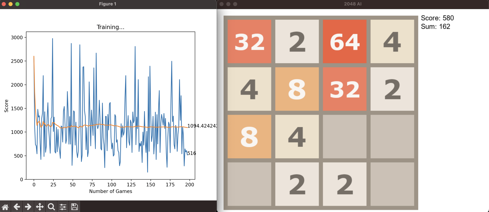

# 2048-AI

This was a project I made over the course of around a week, with the goal of implementing the [PyTorch](https://pytorch.org/) library to play the game [2048](https://play2048.co/) by itself, entirely without user interaction. The game currently has support for tiles up to 2048. It was made using pure Python, and the following libraries
 - [Pygame](https://pygame.org/)
 - [PyTorch](https://pytorch.org/)
 - [IPython](https://ipython.org/)
 - [matplotlib](https://matplotlib.org/)
___
## How to run
#### For starters, every dependency needs to be installed and included in the Python path (follow installation guides on the website of each respective library)
#### The game can be played using either the keyboard or the AI.
___

### Launch **without** AI 
Simply navigate to the file directory and run
> python3 game.py

The game should run, and can be played with the arrow keys, and **ESC** to close.

___

### Launch **with** AI
Run the command
> python3 agent.py

You can now watch as the model plays through games, and graphs its progress over time.

